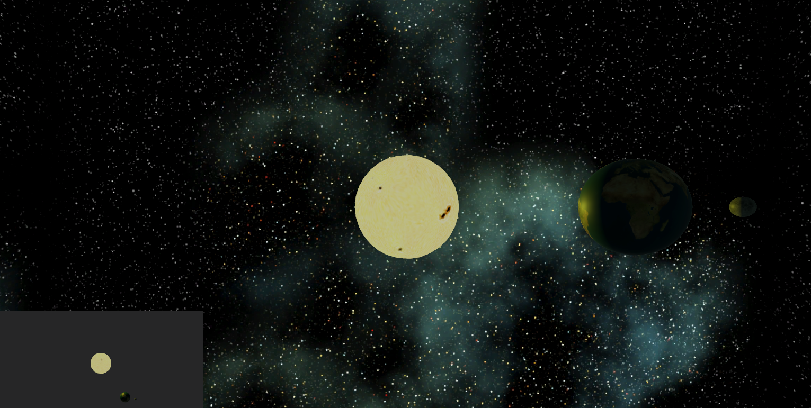
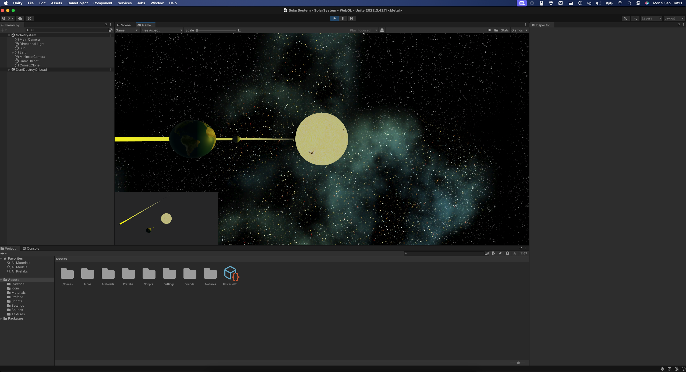

# Simple Solar System

- [Information](#infromation)
- [How to run](#how-to-run)
  - [Download](#download)
  - [Run in unity](#run-in-unity)

## Infromation

This is a assignment for NTNU IDATA2504 where we are going to make a simple solar system in Unity. We follow a tutorial form [Coursera](https://www.coursera.org/lecture/game-design-and-development-1/solar-system-project-overview-jnFTl) to create this project. In this game one can see the sun, earth, moon and metiors. The sun is the main source of lights, and the camera is able to follow a planet one clicks on. An example of the game can be found and played at [itch.io](https://danielneset.itch.io/simple-solar-system).

## How to run

You need to have installed the unity engine to be able to run and work on this project.

### Download

You can download or clone this project from Github. The root folder contains some docs, readme and the folder with the game inside.

### Run in unity

- Open unity hub
- Find and press the add button in "Projects"
- Find the 'Simple-Solar-System' folder and open it
- Done

